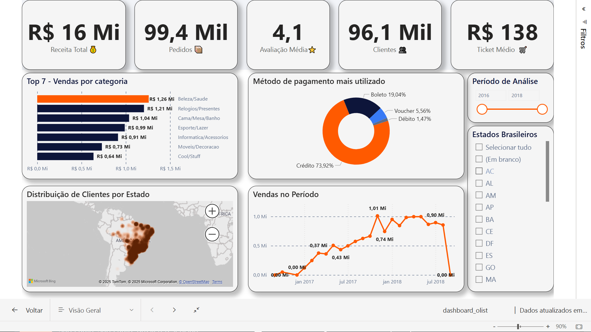
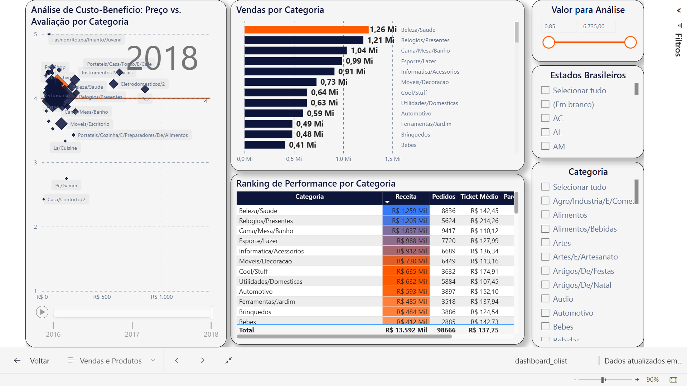
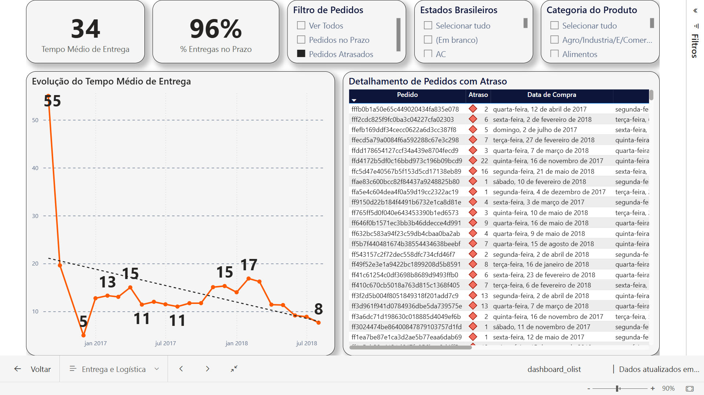
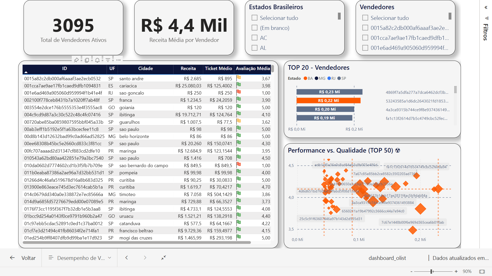

# analise-vendas-olist-powerbi
Dashboard analítico 360° do e-commerce Olist, transformando dados de vendas, logística e reviews em insights acionáveis com Power BI, DAX e Análise de Sentimento (NLP com Python).

# 📊 Dashboard de Análise de Vendas e Logística - Olist

## 1. 🎯 Resumo do Projeto
Este projeto consiste na criação de um dashboard completo em Power BI para análise de performance da Olist, a maior loja de departamentos em marketplaces brasileiros. O painel oferece uma visão 360° do negócio, abrangendo desde KPIs executivos até análises detalhadas de vendas, logística, satisfação do cliente e desempenho dos vendedores.

**[🔗 Clique aqui para acessar o Dashboard Interativo](https://app.powerbi.com/view?r=eyJrIjoiZDNkMGEyYTctNjE2YS00ZTg4LTk2NWUtYTFjYmE5NDA4NWM3IiwidCI6IjMyNDFkMzllLTdiZDEtNDQ2My05ZGFmLWU2M2M2MWZjOWRkYyJ9)**
**[🔗 Clique aqui para baixar o Dashboard no formato .pbix](https://drive.google.com/file/d/1Tjdjn93Ynnyw8OoBOVD1sr8e8VfO5ich/view?usp=sharing)**

---

## 2. 🛠️ Ferramentas e Tecnologias
* **Visualização de Dados:** Microsoft Power BI
* **Tratamento de Dados (ETL):** Power Query M
* **Cálculos e Métricas:** DAX (Data Analysis Expressions)
* **Análise de Sentimento (NLP):** Python (em Google Colab) com as bibliotecas Pandas e Flair.
* **Modelo de NLP:** `PORTULAN/XLMR_Sentiment_Portuguese`

---

## 3. ⚙️ Processo e Metodologia
O desenvolvimento do projeto seguiu algumas das melhores práticas de Business Intelligence, incluindo:

* **Modelagem de Dados:** Construção de um modelo Star Schema no Power BI para otimizar a performance e a clareza das relações. Foi aplicada a técnica de "Role-Playing Dimension" ao duplicar a tabela de geolocalização para análises de origem-destino.
* **Tratamento de Dados:** Limpeza e transformação de dados no Power Query, com atenção especial ao tratamento de valores nulos e à garantia da integridade referencial entre as tabelas de fatos e dimensões.
* **Enriquecimento com NLP:** Um script em Python foi desenvolvido para realizar análise de sentimento nos comentários dos reviews, classificando-os como Positivo, Negativo ou Neutro e gerando um score de polaridade. Este novo dataset enriquecido foi usado para as análises de satisfação.
* **Design e UX:** Criação de um tema JSON customizado baseado na identidade visual da Olist (cores e fontes), garantindo consistência. O layout das páginas foi projetado para contar uma história, guiando o usuário do geral para o específico, utiliziando de recursos como tabela dinâmicas, tooltips customizados e interações de destaque condicional.

---

## 4. 🖼️ Galeria de Páginas do Dashboard
#### Página 1: Visão Geral

#### Página 2: Vendas e Produtos

#### Página 3: Entrega e Logística

#### Página 4: Vendedores

---

## 5. 💡 Principais Insights Gerados
O dashboard permite identificar rapidamente insights como:
* A forte correlação entre o tempo de entrega e as avaliações dos clientes.
* O posicionamento estratégico de cada categoria de produto em uma matriz de Custo vs. Benefício.
* Os principais fluxos logísticos nacionais e os estados com melhores e piores performances de entrega.
* A performance de cada vendedor, cruzando dados de receita com a satisfação dos clientes.

---

## 6. Autor
* **Carlos Vinícius**
* **LinkedIn:** [https://www.linkedin.com/in/carlos-vinicius-nascimento-de-jesus/]
* **GitHub:** [https://github.com/Carllux/] 
